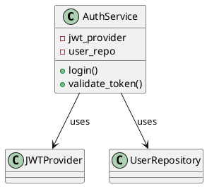

#архитектурные_диаграммы #c4_model #docs 

# Диаграмма кода (Code / Class Diagram)

Диаграмма кода — четвёртый и **наиболее детализированный уровень** нотации C4. Она используется **только при необходимости**, когда нужно понять реализацию конкретного компонента или подсистемы.

---

## 🎯 Назначение

- Показать структуру кода **на уровне классов, функций, интерфейсов**.
- Подходит для ревью, генерации документации, передачи знаний внутри команды.
- Часто опускается в повседневной архитектуре, если не требуется углублённое объяснение.

---

## 🧩 Что отображается на диаграмме?

- **Классы, интерфейсы, модули, функции**.
- Их **взаимосвязи** (наследование, зависимости, имплементация).
- **Методы и свойства** (опционально).
- Отношения типа:
  - A → B (вызов метода, использование)
  - A --|> B (наследование)
  - A ..> B (зависимость)

---

## 📊 Пример (на Python)

```plaintext
Компонент: AuthService

+-------------------+
| AuthService       |
|-------------------|
| + login()         |
| + validate_token()|
|-------------------|
| - jwt_provider    |
| - user_repo       |
+-------------------+

         ^
         |
+---------------------+
| JWTProvider         |
+---------------------+

         ^
         |
+---------------------+
| UserRepository      |
+---------------------+
```





---

## 🧠 Практические советы

- Используй этот уровень **только для ключевых модулей** (например, core-домен).
    
- Не нужно документировать каждый файл/класс — выделяй **значимые элементы**.
    
- Лучше всего сочетается с подходами [[DDD]], Clean Architecture или Hexagonal.
    

---

## 🔧 Инструменты

- **PlantUML** (классическая UML-нотация)
    
- **Structurizr DSL** _не поддерживает этот уровень напрямую_
    
- **Pyreverse**, **IntelliJ**, **UMLet**, **VS Code Extensions**
    

---

## ❗️Когда не использовать

- Когда достаточно диаграмм компонентов или контейнеров.
    
- При высоком уровне изменений в коде — диаграмма быстро устареет.
    
- Если это не повышает ценность документации для команды.